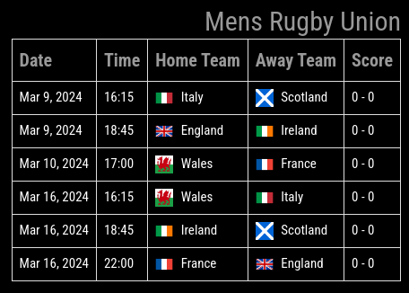
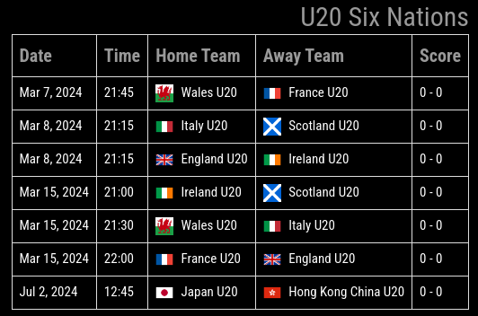

# MMM-Rugby

A [MagicMirror²](https://magicmirror.builders) module to display Rugby data.

[](LICENSE)

## About Module

This module will get the current World Rugby Rankings. A selection of Rugby Leaqgues can be configures to be dispalyed as a second table. This is past matches and results and upcoming matches.

## Examples

The module will always return the World Rankings by default and the selected Rugby League data on the second table when using the `free` collectionType. if `apiSport` is used the requested league Standings will be returned along with the matches, past and upcoming, for the selected league.

### World Rankings


### Mens Rugby Union


### Woman's Seven Series


### Men's Seven Series


### Junior Rugby Series


### Filtered by Leagues


### API-SPORT League Standings


### API-SPORT League Matches


## Dependencies
- "luxon": "^3.4.4",
- "node-fetch": "^2.6.1"
## Installation

In your terminal, go to your MagicMirror's Module folder:
````
cd ~/MagicMirror/modules
````

Clone this repository:
````
git clone https://github.com/mumblebaj/MMM-Rugby.git
````
````
cd MMM-Rugby
npm install
````

Add the module to the modules array in the `config/config.js` file:

Example config for `free`

````javascript
    {
        module: "MMM-Rugby",
        position: "top_right",
        disabled: false,
                config: {
                        updateInterval: 1000*60*60*24,
                        rotateInterval: 60000,
                        autoUpdate: true,
                        sport: "mru",
                        rankingLimit: 10,
                        matchesLimit: 10,
                        matchesOlderThan: 7,
                        competitions: ["Six Nations 2024", "Rugby Europe Conference 2024"],
                        collectionType: "free" // api-key required
                }
    },
````
Example config for `apiSport`

````javascript
    {
        module: "MMM-Rugby",
        position: "top_right",
        disabled: false,
                config: {
                        updateInterval: 1000*60*60,
                        autoUpdate: true,
                        rotateInterval: 60000,
                        rankingLimit: 10,
                        matchesLimit: 10,
                        matchesOlderThan: 7,
                        collectionType: "apiSport", // api-key required
                        apiSports: {
                            apiSportStandingLeagueId: 16,
                            apiSportKey: "your-api-key",
                            apiSportTZ: "Africa/Johannesburg",
                            numberofGamesToDisplay: 10,
                            apiSportsNumRankings: 10,
                            apiSportDaysPast: 7,
                            apiSportsDaysFuture: 14
                        }
                }
    },
````

## Configuration Option

The following properties can be configured:


| Option                       | Description
| ---------------------------- | -----------
| `updateInterval`             | Intrval to refresh Data <br> **Default value:** `1000*60*60*24`. One Day <br> Best to set to a Weekly refresh rate.
| `autoUpdate`                 | Only add this option if you want the update intervals to be managed automatically. Will update as per `updateInterval` all days of the week except Saturdays and Sundays when it will update every 30 minutes. Works in conjunction with the updateInterval. <br><br> Possible value: `true`
| `rotateInterval`             | The Interval to rotate between the tables <br> **Default Value:** `60000` 1 minute
| `sport`                      | The Rugby League to get data for <br> **Possible values:** <br> `wrs`: Woman's Sevens Series 2024 <br> `mrs`: Mens Sevens Series 2024 <br> `jmu`: U20 Six Nations 2024 <br> `mru`: Includes a number of leagues <br> - Six Nations 2024 <br> - Rugby Europe International Chamionship 2024 <br> - Men's Internationals 2024 <br> - Rugby Europe Trophy 2024 <br> - Rugby Europe Conference 2024 <br> - Autumn Nations Series 2024 <br> - The Rugby Championship 2024 <br> Can be removed when collectionType is set to `apiSport`.
| `rankingLimit`               | The Number of Rankings to return for the World Rankings <br> **Default value:** `10`
| `matchesLimit`               | The number of matches to return. <br> **Default value:** `10`
| `matchesOlderThan`           | Will return only matches New than this specified number of days, i.e. if set to 7 will return matches older than current date - 7 and fill the number of matchesLimit with upcoming matches. <br> **Default value:** `7`
| `competitions`               | Only used where collectionType is set to `free`. Can be removed when setting collectionType = `apiSport`. <br> An array of leagues can now be selected to filter the Mens Rugby Union by. <br> **Example** <br> competition: ["The Rugby Championship 2024","Rugby Europe Conference 2024", "Six Nations 2024"] <br><br> If option is not selected then all Leagues will be returned.
| `collectionType`             | There are two options here, `free` or `apiSport`. `free` does not require an api-key whereas `apiSport` requires and api-key. <br> **Default value:** `free` <br> for apiSport you need to register on the [API-SPORT](https://dashboard.api-football.com/register) website. You get 100 free api calls per day.
| `apiSports`                  | In order to use this api a few configs are required specifically for this api. This following section covers that. For the `free` `collectionType` this ection is not required.
| `apiSportStandingsLeagueId`  | The module ships with a list of available leagues for the apiSports. Please see `league_data.json` for your prefered league. Also ensure that your prefered league has an activie season alse no standings or match data will be returned. The code will automatically select the active league if it is available.
| `apiSportKey`                | This is your API-SPORTS Key when you have registered on the API-SPorts Website.
| `apiSportTZ`                 | For local time results please add you Timezone here. You can get the correct value to enter in the api-sports-timezones.json 
| `numberofGamesToDisplay`     | This will limit the number of games returned for the matches view. Best to limit it to 10 or 15 else it could crop the other modules around it.
| `apiSportsNumRankings`       | Limit the number of rankings to return. Same reason as above. Too many will result in the other modules being cropped or shited out of place.
| `apiSportDaysPast`           | Number of days past matches to see. Best to keep this at 7 days as this will cover the games from the previous week and show some of the upcoming games.
| `apiSportsDaysFuture`        | Will limit the number of future games to display. Works in combination with the past `apiSportDaysPast`.

## Updating

To update the module do the following:

````
cd MMM-Rugby
git pull
npm install
````

## Changes

### v1.1.2
- Add a new option `autoUpdate` which will manage the updateInterval automatically. With this option set to `true`, the application will manage the updates every hour Monday to Friday and every 30 minutes on Saturdays and Sundays when it is game day.

### v1.1.1

- Added an option to get data from apiSport.
- Various updates to table displays

### CSS Changes example
If you want to remove the borders on the tables you can add the following to your ~/MagicMirror/css/custom.css

````css
.MMM-Rugby #MMMRugby-rankingTable td,
.MMM-Rugby #misSportMatchesTable td,
.MMM-Rugby #MMMRugby-rankingTable th,
.MMM-Rugby #misSportMatchesTable th,
.MMM-Rugby #rankingMatchesTable td,
.MMM-Rugby #rankingMatchesTable th {
  border: none;
}
````

## Future Enhancements
- [x] Option to select specific MRU Leagues only
- [x] Enhance Display of the Matches table.
- [X] Add an autoUpdate feature to manage the update intervals automatically.

